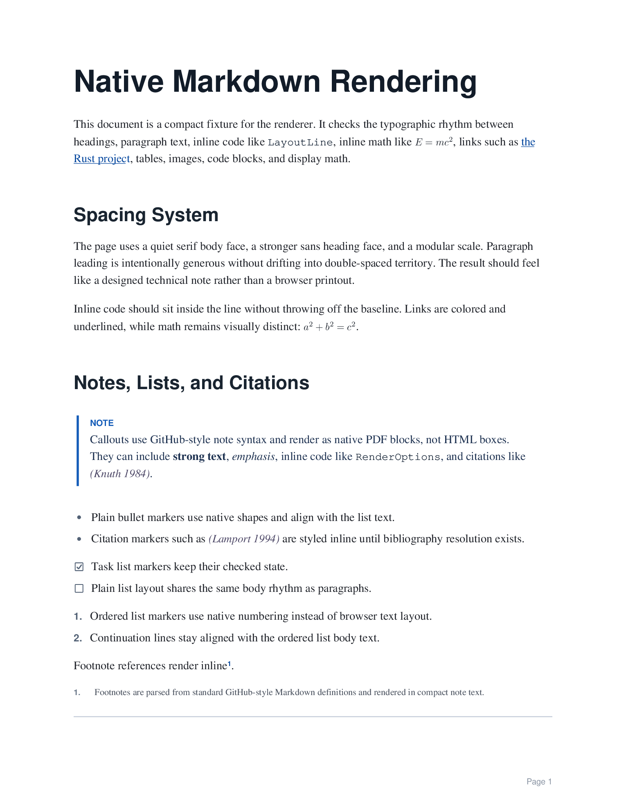
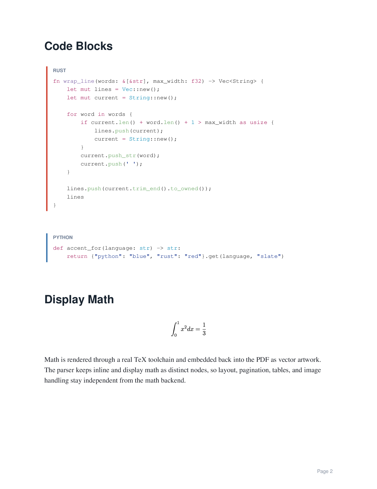
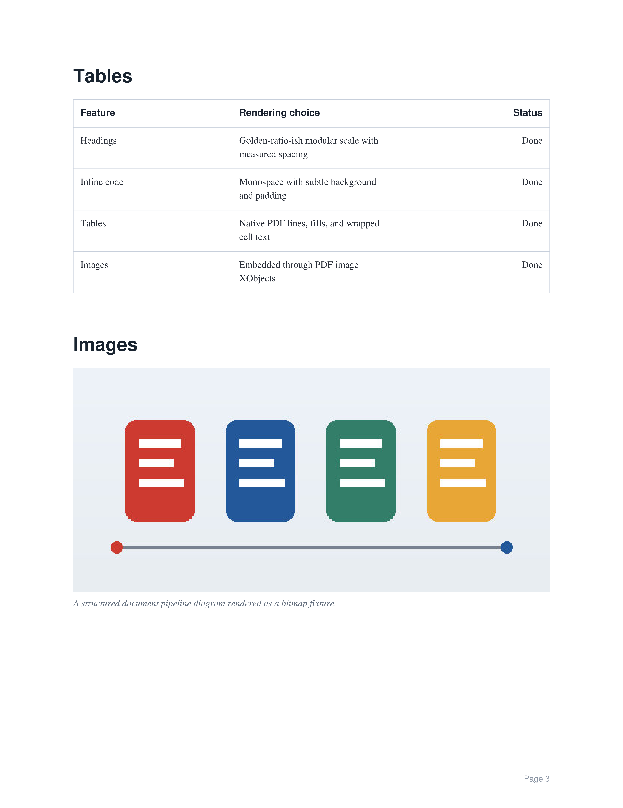
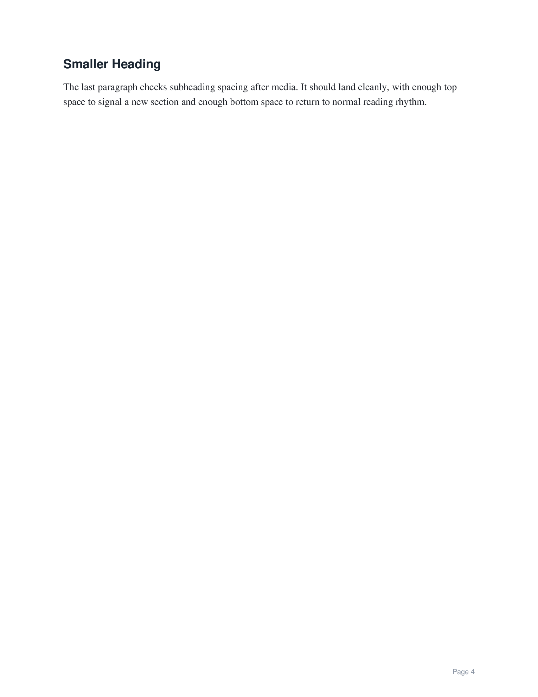

# .md pdf rendering that actually looks good

A native Markdown-to-PDF renderer in Rust that DOES NOT render HTML and then print it. It parses Markdown into a small document IR, lays the document out directly, and paints PDF primitives.

[example](examples/sample.pdf)

